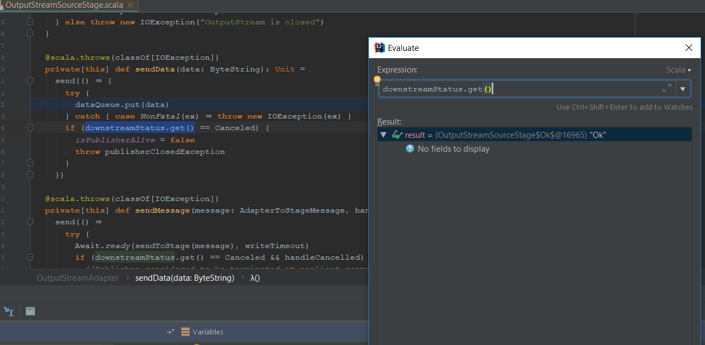

This simple project demonstrated bug with idle timeout.
When server is under load and idle timeout is triggered underlying streams should be closed. But it is not the case and the stream is opened and not interrupted forever.

To see this in action launch app. Go to index to see that app is returning content at first.
Then using `siege` tool launch a siege:
```siege -c 30 http://localhost:9000```
After a moment ` Aborting tcp connection to /10.17.146.94:50714 because of upstream failure` begins to popup in logs. Siege can be stopped. The thread responsible for writing to `OuputStream` is deadlocked, is waiting forever. The stream is not failed.
In debug mode it's possible to lookup what happened to thread.

Here image shows that the underlying `OutputStreamSourceStage` has state `ok` it should be something else. And stack trace for thread:


```
park:-1, Unsafe (sun.misc)
park:175, LockSupport (java.util.concurrent.locks)
await:2039, AbstractQueuedSynchronizer$ConditionObject (java.util.concurrent.locks)
put:350, LinkedBlockingQueue (java.util.concurrent)
$anonfun$sendData$1:172, OutputStreamAdapter (akka.stream.impl.io)
apply$mcV$sp:-1, 829122240 (akka.stream.impl.io.OutputStreamAdapter$$Lambda$4249)
send:163, OutputStreamAdapter (akka.stream.impl.io)
sendData:170, OutputStreamAdapter (akka.stream.impl.io)
write:202, OutputStreamAdapter (akka.stream.impl.io)
writeBytes:221, StreamEncoder (sun.nio.cs)
implWrite:282, StreamEncoder (sun.nio.cs)
write:125, StreamEncoder (sun.nio.cs)
write:207, OutputStreamWriter (java.io)
flushBuffer:129, BufferedWriter (java.io)
write:230, BufferedWriter (java.io)
write:456, PrintWriter (java.io)
write:473, PrintWriter (java.io)
$anonfun$index$4:30, HomeController (controllers)
apply$mcVI$sp:-1, 515796499 (controllers.HomeController$$Lambda$4240)
foreach$mVc$sp:156, Range (scala.collection.immutable)
$anonfun$index$3:29, HomeController (controllers)
apply$mcV$sp:-1, 1576201668 (controllers.HomeController$$Lambda$4239)
apply:12, JFunction0$mcV$sp (scala.runtime.java8)
$anonfun$apply$1:654, Future$ (scala.concurrent)
apply:-1, 1291623966 (scala.concurrent.Future$$$Lambda$4172)
$anonfun$map$1:251, Success (scala.util)
map:209, Success (scala.util)
$anonfun$map$1:288, Future (scala.concurrent)
apply:-1, 864362719 (scala.concurrent.Future$$Lambda$3648)
liftedTree1$1:29, Promise (scala.concurrent.impl)
$anonfun$transform$1:29, Promise (scala.concurrent.impl)
apply:-1, 1517770794 (scala.concurrent.impl.Promise$$Lambda$3307)
run$$$capture:60, CallbackRunnable (scala.concurrent.impl)
run:-1, CallbackRunnable (scala.concurrent.impl)
 - Async stacktrace
<init>:54, CallbackRunnable (scala.concurrent.impl)
onComplete:368, Promise$KeptPromise$Kept (scala.concurrent.impl)
onComplete$:367, Promise$KeptPromise$Kept (scala.concurrent.impl)
onComplete:375, Promise$KeptPromise$Successful (scala.concurrent.impl)
transform:29, Promise (scala.concurrent.impl)
transform$:27, Promise (scala.concurrent.impl)
transform:375, Promise$KeptPromise$Successful (scala.concurrent.impl)
map:288, Future (scala.concurrent)
map$:288, Future (scala.concurrent)
map:375, Promise$KeptPromise$Successful (scala.concurrent.impl)
apply:654, Future$ (scala.concurrent)
$anonfun$index$2:39, HomeController (controllers)
apply:155, Transform (akka.stream.impl)
materialize:476, PhasedFusingActorMaterializer (akka.stream.impl)
materialize:118, SubFusingActorMaterializerImpl (akka.stream.impl)
materialize:107, SubFusingActorMaterializerImpl (akka.stream.impl)
run:556, RunnableGraph (akka.stream.scaladsl)
runWith:103, Source (akka.stream.scaladsl)
akka$http$impl$engine$rendering$HttpResponseRendererFactory$HttpResponseRenderer$$anon$$transfer:114, HttpResponseRendererFactory$HttpResponseRenderer$$anon$1 (akka.http.impl.engine.rendering)
onPush:82, HttpResponseRendererFactory$HttpResponseRenderer$$anon$1$$anon$2 (akka.http.impl.engine.rendering)
processPush:519, GraphInterpreter (akka.stream.impl.fusing)
execute:411, GraphInterpreter (akka.stream.impl.fusing)
runBatch:585, GraphInterpreterShell (akka.stream.impl.fusing)
execute:469, GraphInterpreterShell$AsyncInput (akka.stream.impl.fusing)
processEvent:560, GraphInterpreterShell (akka.stream.impl.fusing)
akka$stream$impl$fusing$ActorGraphInterpreter$$processEvent:742, ActorGraphInterpreter (akka.stream.impl.fusing)
applyOrElse:757, ActorGraphInterpreter$$anonfun$receive$1 (akka.stream.impl.fusing)
aroundReceive:517, Actor (akka.actor)
aroundReceive$:515, Actor (akka.actor)
aroundReceive:667, ActorGraphInterpreter (akka.stream.impl.fusing)
receiveMessage:590, ActorCell (akka.actor)
invoke:559, ActorCell (akka.actor)
processMailbox:257, Mailbox (akka.dispatch)
run:224, Mailbox (akka.dispatch)
exec:234, Mailbox (akka.dispatch)
doExec:260, ForkJoinTask (akka.dispatch.forkjoin)
runTask:1339, ForkJoinPool$WorkQueue (akka.dispatch.forkjoin)
runWorker:1979, ForkJoinPool (akka.dispatch.forkjoin)
run:107, ForkJoinWorkerThread (akka.dispatch.forkjoin)
```
 
